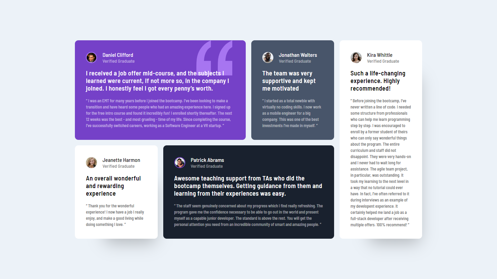
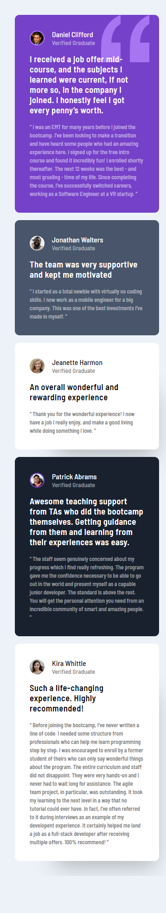

# Frontend Mentor - Testimonials grid section solution

This is a solution to the [Testimonials grid section challenge on Frontend Mentor](https://www.frontendmentor.io/challenges/testimonials-grid-section-Nnw6J7Un7). Frontend Mentor challenges help you improve your coding skills by building realistic projects. 

## Table of contents

- [Overview](#overview)
  - [The challenge](#the-challenge)
  - [Screenshot](#screenshot)
  - [Links](#links)
- [My process](#my-process)
  - [Built with](#built-with)
  - [What I learned](#what-i-learned)
  - [Continued development](#continued-development)
  - [Useful resources](#useful-resources)
- [Author](#author)

## Overview

This challenge was a great introduction to CSS Grid. I learned the basics of Grid and how it works. I kept it simple for now, but I realised that it is very powerfull and it can do things that flexbox can't.

### The challenge

Users should be able to:

- View the optimal layout for the site depending on their device's screen size

### Screenshot

Desktop Full Screen

Desktop in DevTools

Mobile Full Screen

Mobile in DevTools

### Links

- Solution URL: [My Frontend Mentor Profile](https://www.frontendmentor.io/profile/dxiDavid)
- Live Site URL: [Go live](https://testimonial-grid-challenge.pages.dev/)

## My process

I Started by styling the elements before I put them in the design's layout. This is different from how I normally do things but it's because I was learning something new and wanted to start off with basic styling so I could focus more on Grid.

### Built with

- Semantic HTML5 markup
- CSS Utility Classes
- CSS Grid

### What I learned

I learned the basics of CSS Grid, how it works and how to position elements using it. As I've said, I kept it very simple for now since Grid is still very new to me. I also learned how to set up utility classes to avoid repeating myself. I'll definitely use them alot more together with custom properties not only to avoid repetition, but also to make it easier to maintain. 

### Continued development

I'll come back and refactor the CSS code once I've had some experience setting up custom properties.

### Useful resources

- [Youtube](https://www.youtube.com/@KevinPowell) - This is where I found the best tutorials and explanations (For me) on CSS concepts and      writing functional CSS. Kevin Powel really knows his stuff and gives concise explanations.
- [w3schools](https://w3schools.com) - This website has an entire course on CSS with simple examples for both basic and advanced concepts.
- [CSS Tricks](https://css-tricks.com/) - This website provides very well written explanations to CSS concepts as well as examples for when you need to revisit a concept.
- [mdn](https://developer.mozilla.org/en-US/) - Always helpful to read the documentation of any language.

## Author

- Frontend Mentor - [@dxiDavid](https://www.frontendmentor.io/profile/dxiDavid)
- Twitter - [@dxidavid254](https://www.twitter.com/dxidavid254)
